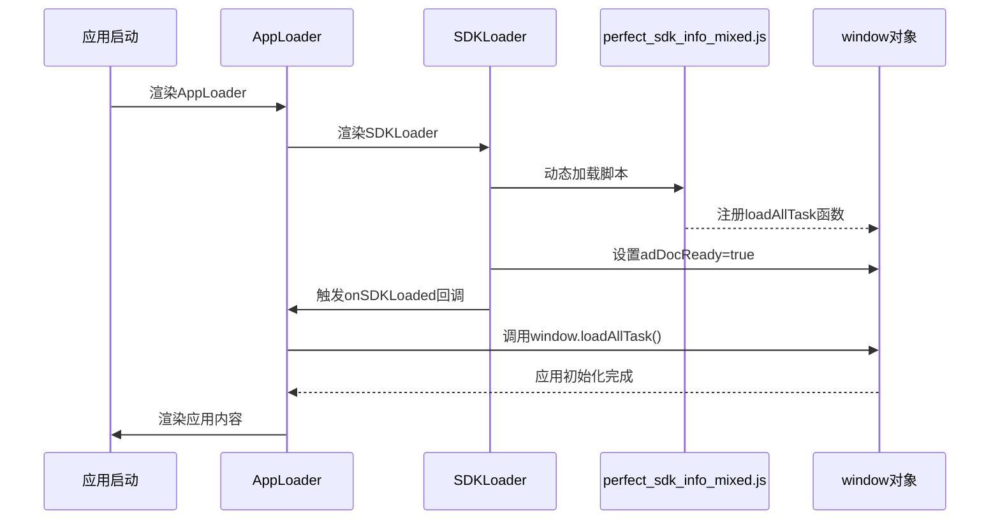

# SDK 加载功能实现文档

## 概述

本项目实现了自动加载和初始化 `perfect_sdk_info_mixed.js` SDK 的功能。该功能通过一系列组件协同工作，确保SDK在应用启动时正确加载并初始化。

## 架构设计

### 组件层次结构

```
RootLayout
├── Providers
└── AppLoader (新增)
    ├── SDKLoader (新增)
    └── 应用内容 (children)
```

### 核心组件

#### 1. SDKLoader (`src/components/SDKLoader/SDKLoader.tsx`)

**职责：**
- 动态加载 `perfect_sdk_info_mixed.js` 脚本
- 监控脚本加载状态
- 提供加载成功回调

**特性：**
- 防重复加载检查
- 错误处理和重试机制
- 开发环境状态显示
- 自动设置 `window.adDocReady = true`

**使用方式：**
```tsx
<SDKLoader onSDKLoaded={() => console.log('SDK已加载')} />
```

#### 2. AppLoader (`src/components/AppLoader/AppLoader.tsx`)

**职责：**
- 协调SDK加载和应用初始化
- 调用 `window.loadAllTask()` 初始化应用
- 提供重试机制和错误处理

**特性：**
- 等待SDK加载完成后再初始化应用
- 智能重试机制（最多20次，每200ms一次）
- 开发环境初始化状态显示
- 即使初始化失败也允许应用继续运行

#### 3. ClientEffects (`src/components/ClientEffects/ClientEffects.tsx`)

**职责：**
- 监控应用状态（已简化）
- 开发环境下定期检查SDK状态

## 加载流程



## 配置说明

### 脚本路径
SDK脚本位于：`/public/perfect_sdk_info_mixed.js`
加载路径：`/perfect_sdk_info_mixed.js`

### 全局变量
- `window.adDocReady`: SDK准备就绪标志
- `window.loadAllTask`: 应用初始化函数

## 开发调试

### 1. 开发环境状态指示器

在开发环境下，页面右上角会显示加载状态：
- 🔵 "Loading SDK..." - SDK加载中
- 🟢 "SDK Loaded ✓" - SDK加载成功
- 🔴 "SDK Error: ..." - SDK加载失败
- 🟠 "App Initializing..." - 应用初始化中

### 2. 测试页面

访问 `/test-sdk` 页面可以：
- 查看SDK加载状态
- 手动调用 `loadAllTask()` 函数
- 实时监控SDK状态变化

### 3. 控制台日志

所有组件都提供详细的控制台日志：
- `🚀 [SDKLoader]` - SDK加载相关日志
- `🎯 [AppLoader]` - 应用初始化相关日志
- `🎨 [ClientEffects]` - 客户端效果相关日志

## 错误处理

### SDK加载失败
- 显示错误状态指示器
- 记录详细错误日志
- 不阻止应用继续运行

### 应用初始化失败
- 自动重试机制（20次，每200ms）
- 超时后允许应用继续运行
- 详细的重试日志

## 性能优化

1. **防重复加载**：检查现有脚本标签
2. **异步加载**：使用 `async` 和 `defer` 属性
3. **智能重试**：避免无限重试
4. **条件渲染**：生产环境不显示状态指示器

## 使用示例

### 基本使用
应用已自动集成，无需额外配置。

### 自定义回调
```tsx
// 在需要的地方监听SDK加载状态
useEffect(() => {
  const checkSDK = () => {
    if (window.adDocReady && window.loadAllTask) {
      // SDK已准备就绪，执行自定义逻辑
      console.log('SDK已准备就绪');
    }
  };
  
  const interval = setInterval(checkSDK, 100);
  return () => clearInterval(interval);
}, []);
```

## 故障排除

### 常见问题

1. **SDK脚本404错误**
   - 检查 `public/perfect_sdk_info_mixed.js` 文件是否存在
   - 确认文件路径正确

2. **loadAllTask函数不存在**
   - 检查SDK脚本是否正确加载
   - 确认脚本内容是否包含loadAllTask函数定义

3. **应用初始化失败**
   - 查看控制台错误日志
   - 检查SDK脚本是否有语法错误

### 调试步骤

1. 打开浏览器开发者工具
2. 查看Network标签，确认SDK脚本加载状态
3. 查看Console标签，查看详细日志
4. 访问 `/test-sdk` 页面进行状态检查

## 更新日志

- **v1.0.0** - 初始实现
  - 创建SDKLoader和AppLoader组件
  - 实现自动加载和初始化功能
  - 添加开发环境调试功能
  - 创建测试页面 